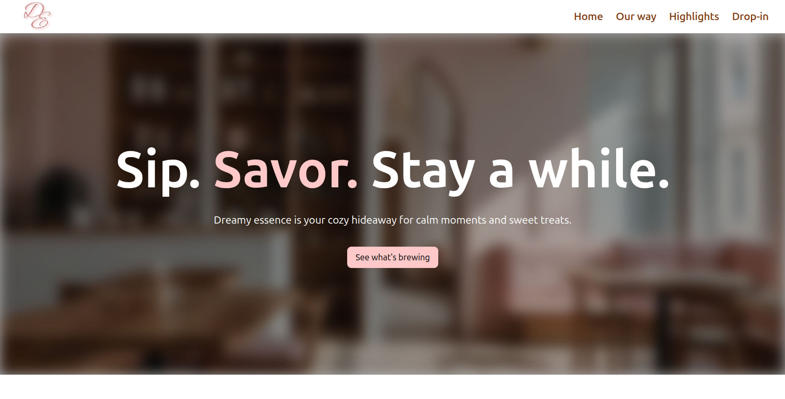

# Dreamy Essence Cafe landing page



A minimalist, calming landing page for a specialty coffee shop focused on serene experiences. Built with React and Tailwind CSS.

## ✨ Features

- **Responsive Design**: Adapts seamlessly from mobile to desktop
- **Atmospheric Sections**:
  - Hero with mood-setting typography
  - Coffee menu with horizontal scrolling
  - Owner's note with custom dividers
- **Accessibility Focused**: Keyboard navigable

## 🚀 Installation

1. Clone the repository:
```bash
git clone https://github.com/l-auta/dreamy-essence.git
```
2. Install dependencies:
```bash
npm install
```
3. Run development server:
```bash
npm run dev
```
3. Build for production:
```bash
npm run build
```

## 📝 License
MIT License - see LICENSE

###  Brewed With Precision 🔬

